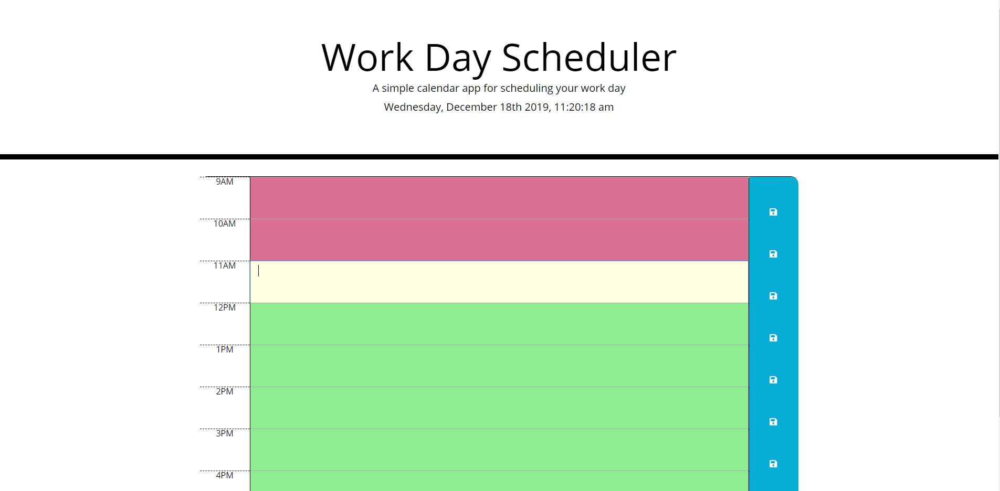

# Day Planner

This is a simple yet elegant application for keeping track of your daily objectives.

# Features

The current time and day will be displayed at the top automatically depending on your IP Address location.

If you type information in the text field and click the blue save button on the right side, your tasks will be saved to local storage so that they will persist no matter if the browser closes or refreshes.

The day planner is also color formatted to indicate the current time of day. The parts of the day that are in the past will be red, the current hour yellow, and the future hours green.

# Screen Shot

